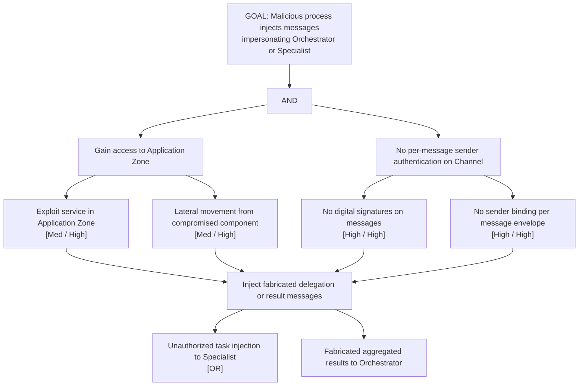

# Attack Tree: S-5 — Inter-Agent Channel Identity Injection

**Chain-breaking control**: Implement per-message digital signatures (ED25519 or HMAC-SHA256) on all channel messages. Bind sender identity to each message envelope. Reject unsigned or unverifiable messages without processing.
