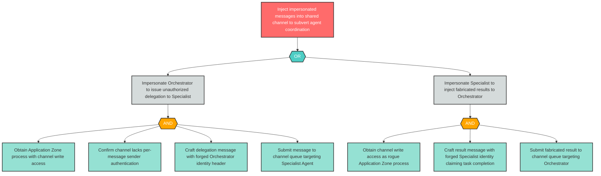

# Attack Tree: S-5 — Malicious Process Injects Impersonated Messages into Shared Channel

**Finding ID**: S-5
**Risk Level**: Critical
**Component**: Inter-Agent Communication Channel
**Delta Status**: UNCHANGED

