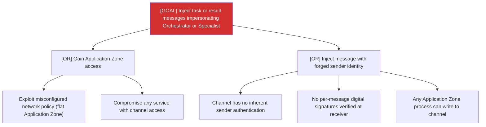

# Attack Tree: S-5 — Inter-Agent Communication Channel

**Risk Level**: Critical
**Component**: Inter-Agent Communication Channel
**Threat**: Malicious process injects impersonated messages into shared channel

