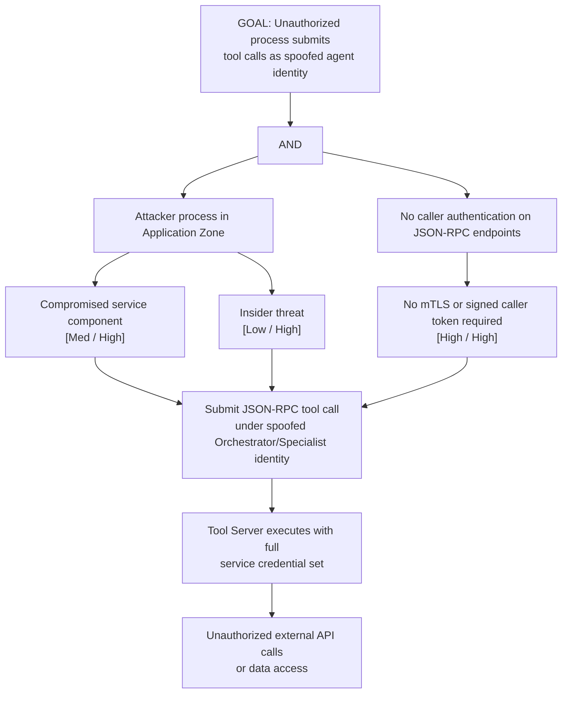

# Attack Tree: S-6 — MCP Tool Server Caller Spoofing

**Chain-breaking control**: Enforce caller authentication on all JSON-RPC endpoints. Each agent must present a signed caller token or mTLS certificate. The Tool Server must verify the caller's identity before executing any tool invocation.
