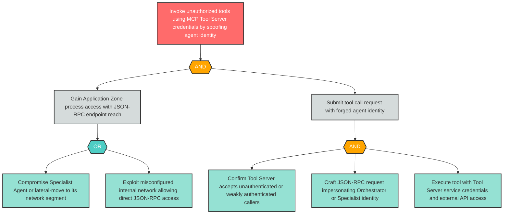

# Attack Tree: S-6 — Application Zone Process Spoofs Agent to Submit Unauthorized Tool Calls

**Finding ID**: S-6
**Risk Level**: Critical
**Component**: MCP Tool Server
**Delta Status**: UNCHANGED

