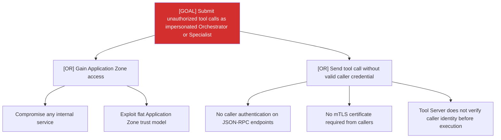

# Attack Tree: S-6 — MCP Tool Server

**Risk Level**: Critical
**Component**: MCP Tool Server
**Threat**: Unauthorized tool call requests via agent impersonation

```mermaid
graph TD
    Goal["[GOAL] Submit unauthorized tool calls as impersonated Orchestrator or Specialist"]
    Goal --> A["[OR] Gain Application Zone access"]
    A --> A1["Compromise any internal service"]
    A --> A2["Exploit flat Application Zone trust model"]
    Goal --> B["[OR] Send tool call without valid caller credential"]
    B --> B1["No caller authentication on JSON-RPC endpoints"]
    B --> B2["No mTLS certificate required from callers"]
    B --> B3["Tool Server does not verify caller identity before execution"]
    classDef critical fill:#d32f2f,color:#fff
    class Goal critical
```
