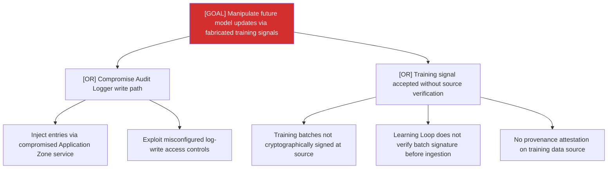

# Attack Tree: S-7 — Long-Running Learning Loop

**Risk Level**: Critical
**Component**: Long-Running Learning Loop
**Threat**: Fabricated training signal injection from compromised Audit Logger

```mermaid
graph TD
    Goal["[GOAL] Manipulate future model updates via fabricated training signals"]
    Goal --> A["[OR] Compromise Audit Logger write path"]
    A --> A1["Inject entries via compromised Application Zone service"]
    A --> A2["Exploit misconfigured log-write access controls"]
    Goal --> B["[OR] Training signal accepted without source verification"]
    B --> B1["Training batches not cryptographically signed at source"]
    B --> B2["Learning Loop does not verify batch signature before ingestion"]
    B --> B3["No provenance attestation on training data source"]
    classDef critical fill:#d32f2f,color:#fff
    class Goal critical
```
