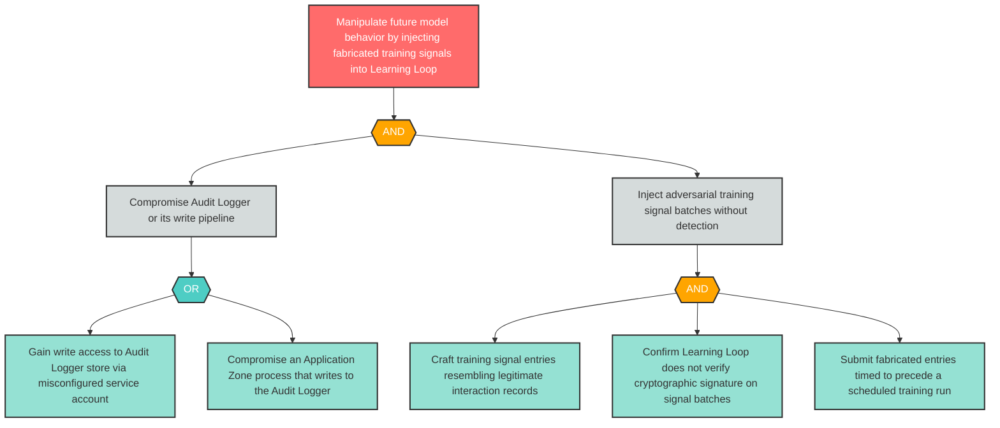

# Attack Tree: S-7 — Fabricated Training Signals Injected via Compromised Audit Logger

**Finding ID**: S-7
**Risk Level**: Critical
**Component**: Long-Running Learning Loop
**Delta Status**: UNCHANGED

