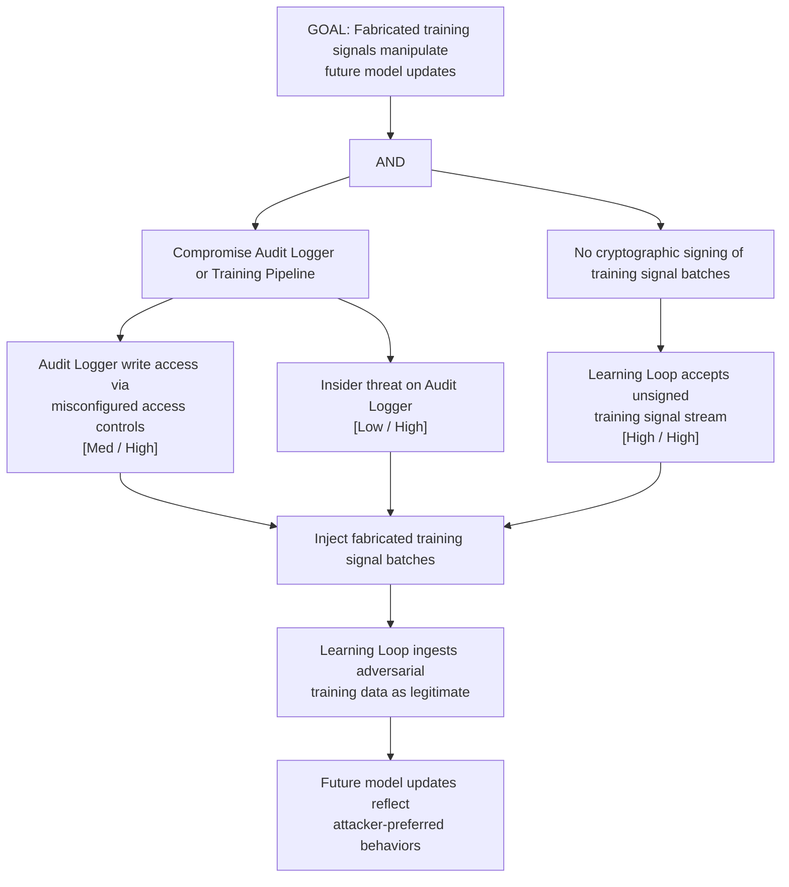

# Attack Tree: S-7 — Learning Loop Training Signal Spoofing

**Chain-breaking control**: Cryptographically sign each training signal batch at the Audit Logger before emission. The Learning Loop MUST verify the signature before ingestion. Implement provenance attestation for all training data.
