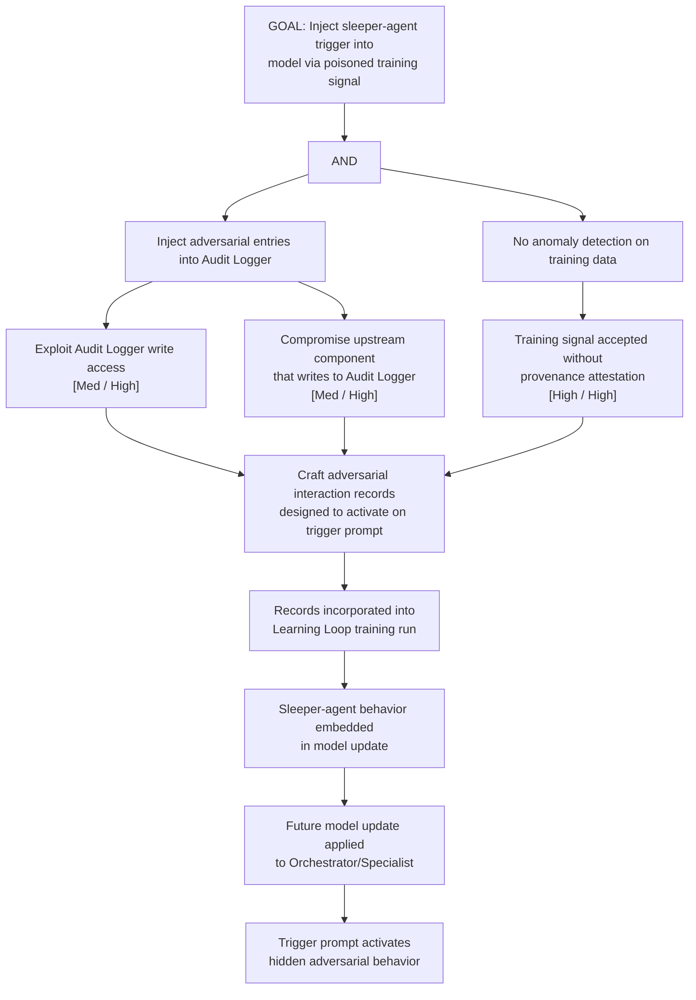

# Attack Tree: T-8 — Learning Loop Training Signal Poisoning (Temporal Attack)

**Chain-breaking control**: Apply training data provenance attestation with verifiable origin signatures per log entry. Implement anomaly detection on training signal distributions. Limit influence of any single data source; apply gradient clipping and differential privacy during training.
