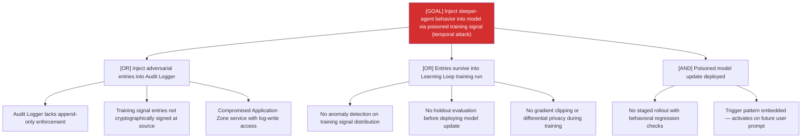

# Attack Tree: T-8 — Long-Running Learning Loop

**Risk Level**: Critical
**Component**: Long-Running Learning Loop
**Threat**: Temporal data poisoning with sleeper-agent injection via training cycle

