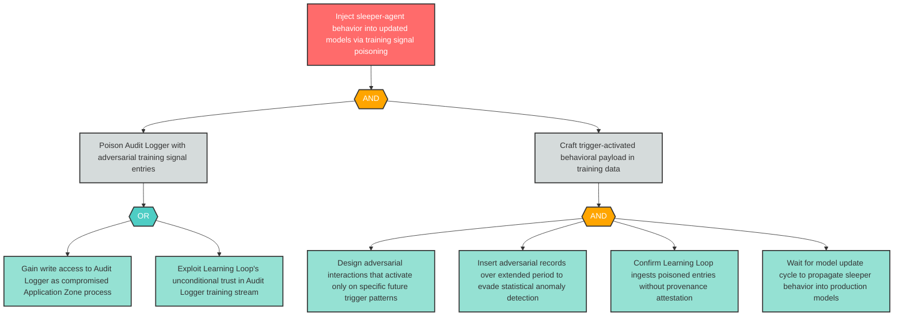

# Attack Tree: T-8 — Temporal Training Signal Poisoning with Sleeper-Agent Injection

**Finding ID**: T-8
**Risk Level**: Critical
**Component**: Long-Running Learning Loop
**Delta Status**: UNCHANGED

