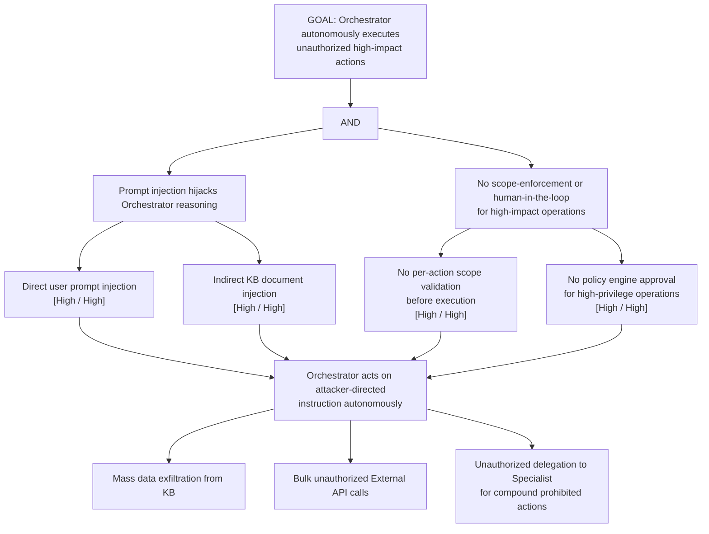

# Attack Tree: AG-1 — LLM Agent Orchestrator Unauthorized Autonomous Action

**Chain-breaking control**: Implement a scope-enforcement layer requiring every proposed action to be validated against the user session's permitted scope. Apply human-in-the-loop confirmation for high-impact operations. Use a supervised-autonomy model with a separate policy engine.
