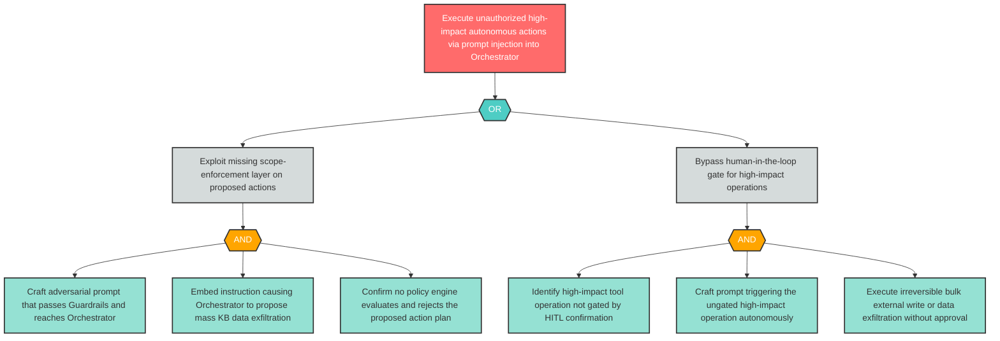

# Attack Tree: AG-1 — Prompt Injection Causes Autonomous Unauthorized High-Impact Actions

**Finding ID**: AG-1
**Risk Level**: Critical
**Component**: LLM Agent Orchestrator
**Delta Status**: UNCHANGED

