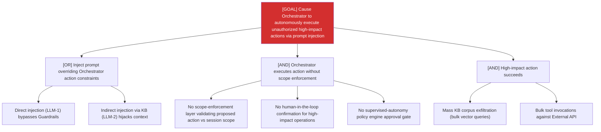

# Attack Tree: AG-1 — LLM Agent Orchestrator

**Risk Level**: Critical
**Component**: LLM Agent Orchestrator
**Threat**: Prompt injection causes autonomous unauthorized high-impact actions

```mermaid
graph TD
    Goal["[GOAL] Cause Orchestrator to autonomously execute unauthorized high-impact actions via prompt injection"]
    Goal --> A["[OR] Inject prompt overriding Orchestrator action constraints"]
    A --> A1["Direct injection (LLM-1) bypasses Guardrails"]
    A --> A2["Indirect injection via KB (LLM-2) hijacks context"]
    Goal --> B["[AND] Orchestrator executes action without scope enforcement"]
    B --> B1["No scope-enforcement layer validating proposed action vs session scope"]
    B --> B2["No human-in-the-loop confirmation for high-impact operations"]
    B --> B3["No supervised-autonomy policy engine approval gate"]
    Goal --> C["[AND] High-impact action succeeds"]
    C --> C1["Mass KB corpus exfiltration (bulk vector queries)"]
    C --> C2["Bulk tool invocations against External API"]
    classDef critical fill:#d32f2f,color:#fff
    class Goal critical
```
