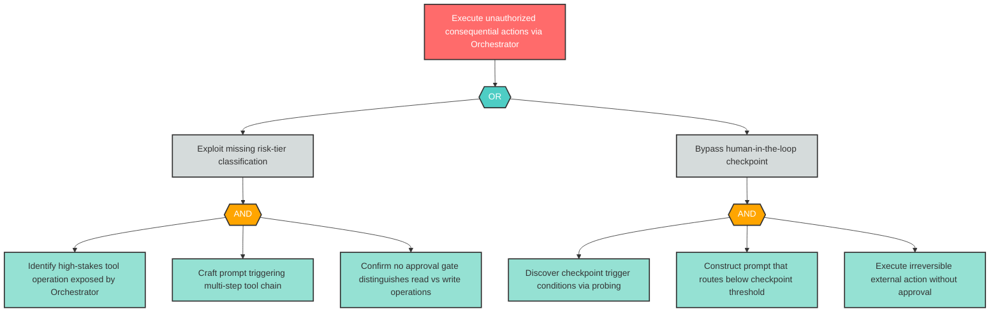

# Attack Tree: AG-1 -- Autonomous Consequential Action Execution

| Field | Value |
|-------|-------|
| Finding ID | AG-1 |
| Component | LLM Agent Orchestrator |
| Risk Level | Critical |
| Threat | Autonomous Consequential Action Execution |
| Correlation | CG-2 (See also: E-2) |

