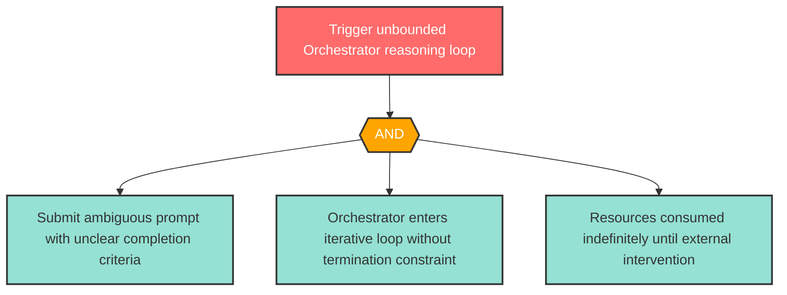

# Attack Tree: AG-2 -- Unbounded Agent Reasoning Loop

| Field | Value |
|-------|-------|
| Finding ID | AG-2 |
| Component | LLM Agent Orchestrator |
| Risk Level | High |
| Threat | Unbounded Agent Reasoning Loop |
| Correlation | CG-3 (See also: R-3) |

