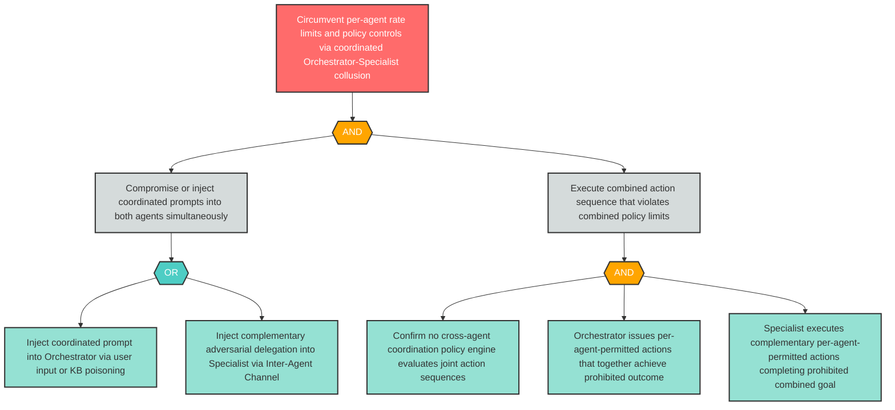

# Attack Tree: AG-2 — Orchestrator and Specialist Coordinate to Circumvent Per-Agent Policy Limits

**Finding ID**: AG-2
**Risk Level**: Critical
**Component**: LLM Agent Orchestrator
**Delta Status**: UNCHANGED

