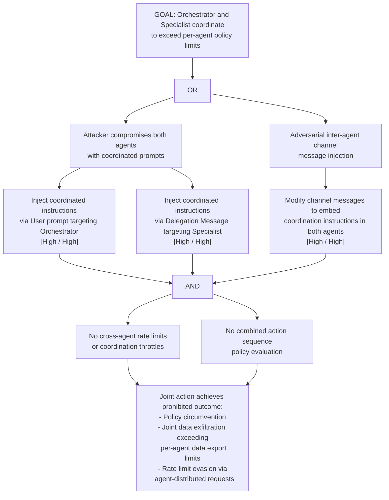

# Attack Tree: AG-2 — Agent Collusion: Orchestrator + Specialist Coordination

**Chain-breaking control**: Implement cross-agent rate limits and coordination throttles at the Channel level. Log all inter-agent coordination patterns to the Audit Logger. Apply a policy engine that evaluates the combined effect of multi-agent action sequences. Enforce per-agent AND per-session action budgets independently.
