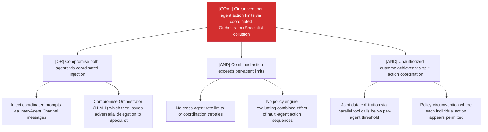

# Attack Tree: AG-2 — LLM Agent Orchestrator

**Risk Level**: Critical
**Component**: LLM Agent Orchestrator
**Threat**: Orchestrator+Specialist coordinate to circumvent per-agent policy limits

```mermaid
graph TD
    Goal["[GOAL] Circumvent per-agent action limits via coordinated Orchestrator+Specialist collusion"]
    Goal --> A["[OR] Compromise both agents via coordinated injection"]
    A --> A1["Inject coordinated prompts via Inter-Agent Channel messages"]
    A --> A2["Compromise Orchestrator (LLM-1) which then issues adversarial delegation to Specialist"]
    Goal --> B["[AND] Combined action exceeds per-agent limits"]
    B --> B1["No cross-agent rate limits or coordination throttles"]
    B --> B2["No policy engine evaluating combined effect of multi-agent action sequences"]
    Goal --> C["[AND] Unauthorized outcome achieved via split-action coordination"]
    C --> C1["Joint data exfiltration via parallel tool calls below per-agent threshold"]
    C --> C2["Policy circumvention where each individual action appears permitted"]
    classDef critical fill:#d32f2f,color:#fff
    class Goal critical
```
