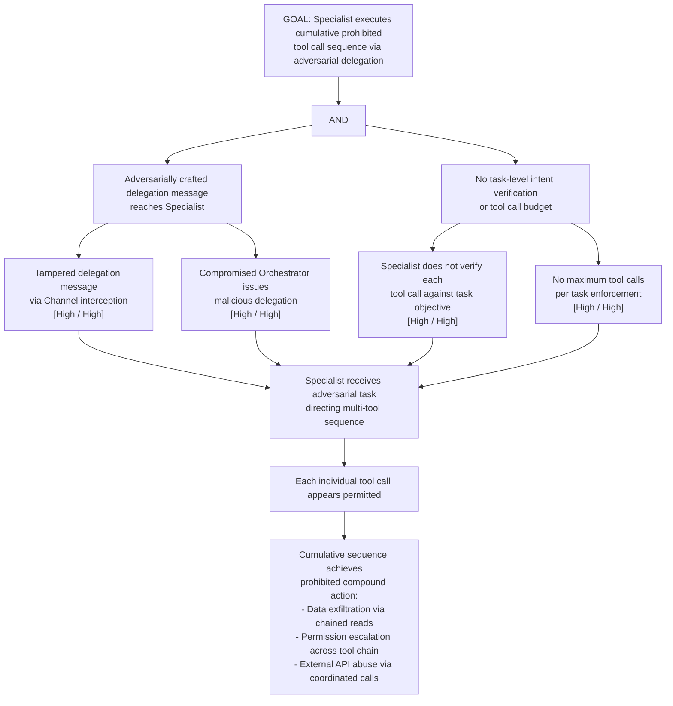

# Attack Tree: AG-3 — Specialist Agent Cumulative Prohibited Tool Call Sequence

**Chain-breaking control**: Implement task-level intent verification: the Specialist MUST check that each tool invocation in a task sequence is consistent with the task's stated objective. Apply a budget on tool calls per task (maximum N calls); require re-authorization from the Orchestrator for task extensions.
