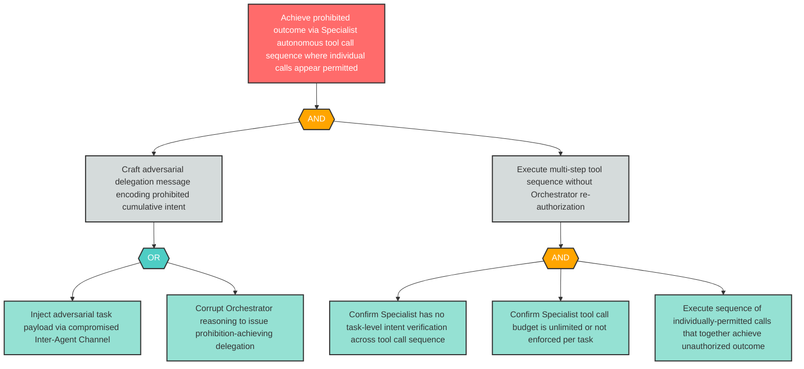

# Attack Tree: AG-3 — Adversarial Delegation Causes Specialist to Execute Prohibited Cumulative Tool Sequence

**Finding ID**: AG-3
**Risk Level**: Critical
**Component**: Specialist Agent
**Delta Status**: UNCHANGED

