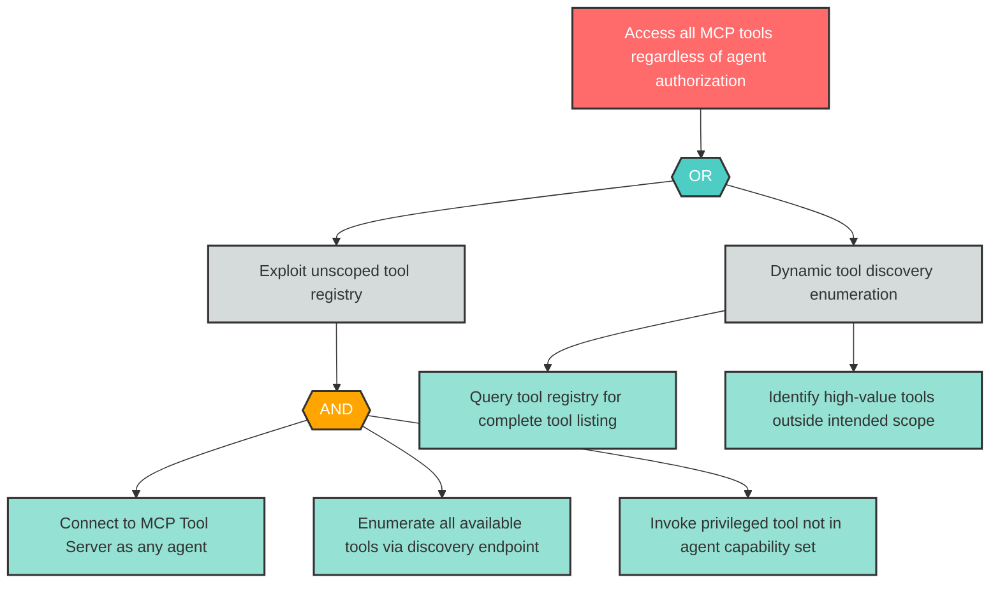

# Attack Tree: AG-3 -- Unscoped Tool Access on MCP Server

| Field | Value |
|-------|-------|
| Finding ID | AG-3 |
| Component | MCP Tool Server |
| Risk Level | Critical |
| Threat | Unscoped Tool Access on MCP Server |
| Correlation | None |

