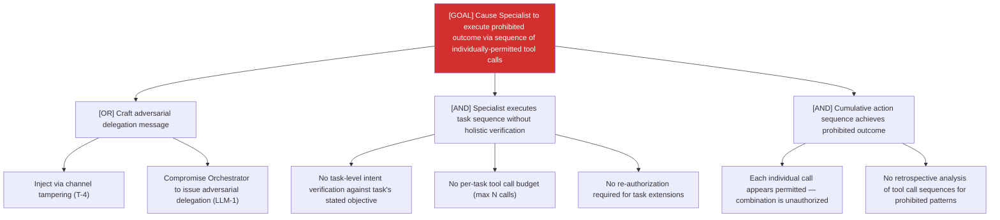

# Attack Tree: AG-3 — Specialist Agent

**Risk Level**: Critical
**Component**: Specialist Agent
**Threat**: Adversarial delegation causes autonomous prohibited cumulative tool call sequence

```mermaid
graph TD
    Goal["[GOAL] Cause Specialist to execute prohibited outcome via sequence of individually-permitted tool calls"]
    Goal --> A["[OR] Craft adversarial delegation message"]
    A --> A1["Inject via channel tampering (T-4)"]
    A --> A2["Compromise Orchestrator to issue adversarial delegation (LLM-1)"]
    Goal --> B["[AND] Specialist executes task sequence without holistic verification"]
    B --> B1["No task-level intent verification against task's stated objective"]
    B --> B2["No per-task tool call budget (max N calls)"]
    B --> B3["No re-authorization required for task extensions"]
    Goal --> C["[AND] Cumulative action sequence achieves prohibited outcome"]
    C --> C1["Each individual call appears permitted — combination is unauthorized"]
    C --> C2["No retrospective analysis of tool call sequences for prohibited patterns"]
    classDef critical fill:#d32f2f,color:#fff
    class Goal critical
```
