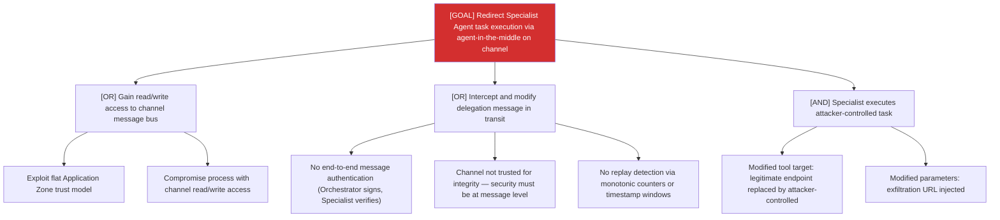

# Attack Tree: AG-4 — Inter-Agent Communication Channel

**Risk Level**: Critical
**Component**: Inter-Agent Communication Channel
**Threat**: Agent-in-the-middle intercepts and modifies delegation messages

