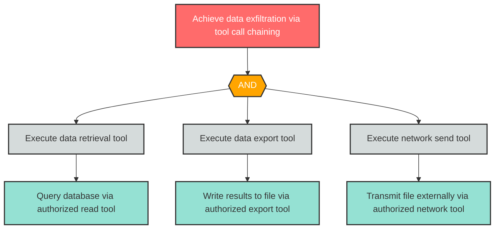

# Attack Tree: AG-4 -- Capability Escalation via Tool Chaining

| Field | Value |
|-------|-------|
| Finding ID | AG-4 |
| Component | MCP Tool Server |
| Risk Level | High |
| Threat | Capability Escalation via Tool Chaining |
| Correlation | CG-4 (See also: D-3) |

