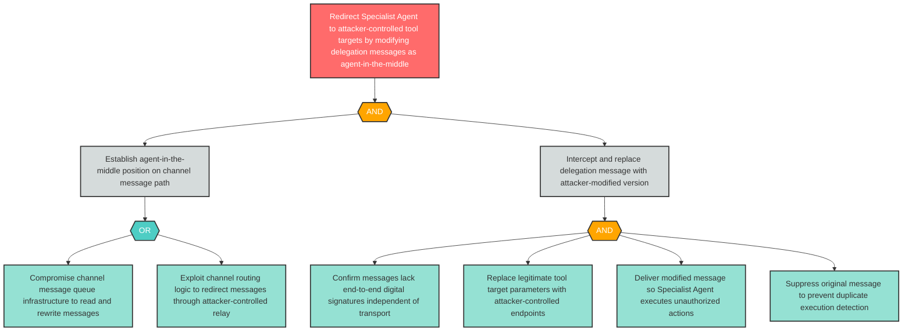

# Attack Tree: AG-4 — Agent-in-the-Middle Intercepts and Modifies Delegation Messages via Compromised Channel

**Finding ID**: AG-4
**Risk Level**: Critical
**Component**: Inter-Agent Communication Channel
**Delta Status**: UNCHANGED

