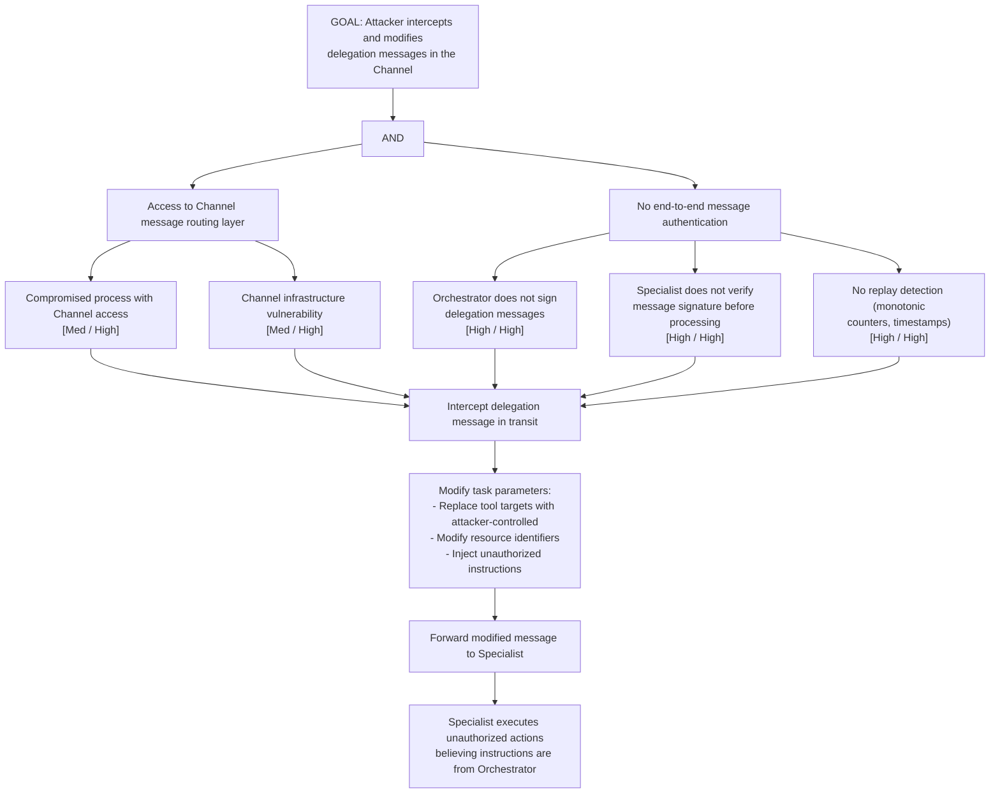

# Attack Tree: AG-4 — Inter-Agent Channel Agent-in-the-Middle Attack

**Chain-breaking control**: Implement end-to-end message authentication with digital signatures (Orchestrator signs, Specialist verifies). The Channel itself MUST NOT be trusted for integrity. Implement replay detection (monotonic message counters, timestamp windows).
