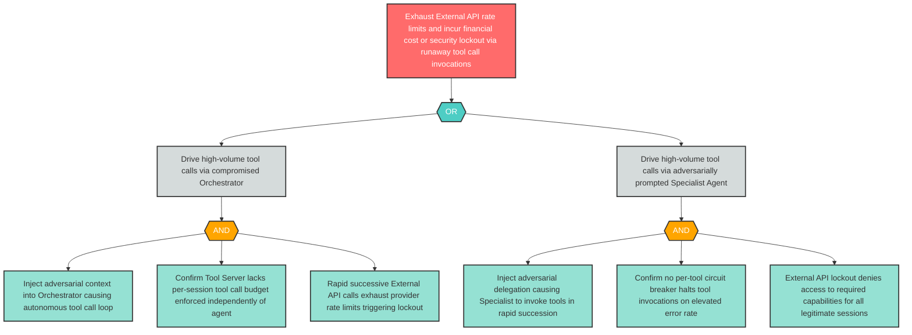

# Attack Tree: AG-6 — Runaway Agent-Driven Tool Calls Exhaust External API Rate Limits

**Finding ID**: AG-6
**Risk Level**: High
**Component**: MCP Tool Server
**Delta Status**: UNCHANGED

```mermaid
flowchart TD
    AG6_root["Exhaust External API rate limits and incur financial cost or security lockout via runaway tool call invocations"]
    AG6_or1{{"OR"}}
    AG6_sub1["Drive high-volume tool calls via compromised Orchestrator"]
    AG6_sub2["Drive high-volume tool calls via adversarially prompted Specialist Agent"]
    AG6_and1{{"AND"}}
    AG6_leaf1["Inject adversarial context into Orchestrator causing autonomous tool call loop"]
    AG6_leaf2["Confirm Tool Server lacks per-session tool call budget enforced independently of agent"]
    AG6_leaf3["Rapid successive External API calls exhaust provider rate limits triggering lockout"]
    AG6_and2{{"AND"}}
    AG6_leaf4["Inject adversarial delegation causing Specialist to invoke tools in rapid succession"]
    AG6_leaf5["Confirm no per-tool circuit breaker halts tool invocations on elevated error rate"]
    AG6_leaf6["External API lockout denies access to required capabilities for all legitimate sessions"]

    AG6_root --> AG6_or1
    AG6_or1 --> AG6_sub1
    AG6_or1 --> AG6_sub2
    AG6_sub1 --> AG6_and1
    AG6_and1 --> AG6_leaf1
    AG6_and1 --> AG6_leaf2
    AG6_and1 --> AG6_leaf3
    AG6_sub2 --> AG6_and2
    AG6_and2 --> AG6_leaf4
    AG6_and2 --> AG6_leaf5
    AG6_and2 --> AG6_leaf6

    classDef goal fill:#ff6b6b,stroke:#333,stroke-width:2px,color:#fff
    classDef andGate fill:#ffa500,stroke:#333,stroke-width:2px,color:#fff
    classDef orGate fill:#4ecdc4,stroke:#333,stroke-width:2px,color:#fff
    classDef subGoal fill:#d5dbdb,stroke:#333,stroke-width:2px,color:#333
    classDef leaf fill:#95e1d3,stroke:#333,stroke-width:2px,color:#333

    class AG6_root goal
    class AG6_or1 orGate
    class AG6_and1,AG6_and2 andGate
    class AG6_sub1,AG6_sub2 subGoal
    class AG6_leaf1,AG6_leaf2,AG6_leaf3,AG6_leaf4,AG6_leaf5,AG6_leaf6 leaf
```
