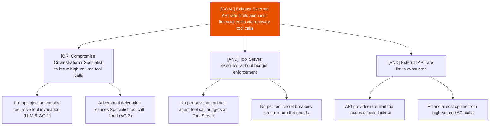

# Attack Tree: AG-6 — MCP Tool Server

**Risk Level**: High
**Component**: MCP Tool Server
**Threat**: Runaway agent-driven tool calls exhaust External API rate limits

```mermaid
graph TD
    Goal["[GOAL] Exhaust External API rate limits and incur financial costs via runaway tool calls"]
    Goal --> A["[OR] Compromise Orchestrator or Specialist to issue high-volume tool calls"]
    A --> A1["Prompt injection causes recursive tool invocation (LLM-6, AG-1)"]
    A --> A2["Adversarial delegation causes Specialist tool call flood (AG-3)"]
    Goal --> B["[AND] Tool Server executes without budget enforcement"]
    B --> B1["No per-session and per-agent tool call budgets at Tool Server"]
    B --> B2["No per-tool circuit breakers on error rate thresholds"]
    Goal --> C["[AND] External API rate limits exhausted"]
    C --> C1["API provider rate limit trip causes access lockout"]
    C --> C2["Financial cost spikes from high-volume API calls"]
    classDef high fill:#e65100,color:#fff
    class Goal high
```
