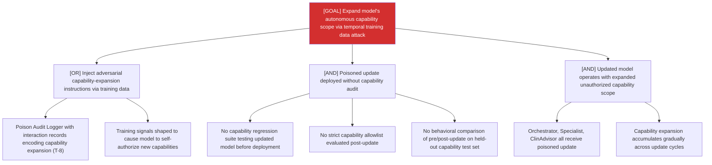

# Attack Tree: AG-7 — Long-Running Learning Loop

**Risk Level**: Critical
**Component**: Long-Running Learning Loop
**Threat**: Training data causes model to expand autonomous action scope on next update

