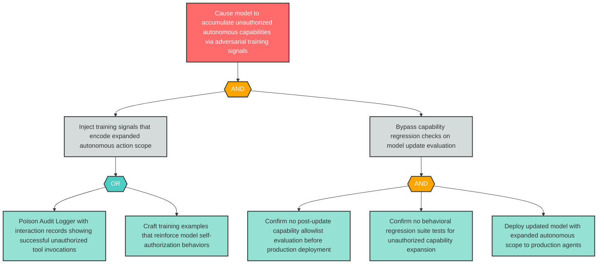

# Attack Tree: AG-7 — Training Data Causes Model to Expand Autonomous Action Scope on Next Update

**Finding ID**: AG-7
**Risk Level**: Critical
**Component**: Long-Running Learning Loop
**Delta Status**: UNCHANGED

