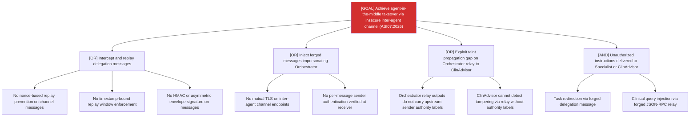

# Attack Tree: AG-8 — Inter-Agent Communication Channel

**Risk Level**: Critical
**Component**: Inter-Agent Communication Channel
**Threat**: Insecure inter-agent communication enables agent-in-the-middle attacks (OWASP ASI07:2026)

