# Attack Tree: AG-8 — Insecure Inter-Agent Communication

**Finding ID**: AG-8
**Risk Level**: Critical
**Component**: Inter-Agent Communication Channel
**OWASP Reference**: ASI-07 (OWASP ASI07:2026)
**Delta Status**: NEW

```mermaid
flowchart TD
    AG8_root["Exploit insecure inter-agent channel to inject or replay messages"]
    AG8_or1{{"OR"}}
    AG8_sub1["Perform agent-in-the-middle via unsigned channel messages"]
    AG8_sub2["Replay captured delegation messages without nonce enforcement"]
    AG8_sub3["Propagate attacker content via Orchestrator relay without taint labels"]
    AG8_and1{{"AND"}}
    AG8_leaf1["Gain network-position or Application Zone process access"]
    AG8_leaf2["Intercept delegation message lacking HMAC or Ed25519 envelope signature"]
    AG8_leaf3["Modify task parameters or inject unauthorized instructions"]
    AG8_leaf4["Forward altered message to Specialist Agent for execution"]
    AG8_and2{{"AND"}}
    AG8_leaf5["Capture valid delegation message from Orchestrator to Specialist"]
    AG8_leaf6["Identify absence of timestamp-bound nonce or monotonic counter"]
    AG8_leaf7["Replay captured message after original task completes to re-execute action"]
    AG8_and3{{"AND"}}
    AG8_leaf8["Compromise Orchestrator relay function or inject into its context"]
    AG8_leaf9["Confirm relay output lacks upstream sender authority labels"]
    AG8_leaf10["Forward relay output to ClinAdvisor as trusted orchestrator instruction"]

    AG8_root --> AG8_or1
    AG8_or1 --> AG8_sub1
    AG8_or1 --> AG8_sub2
    AG8_or1 --> AG8_sub3
    AG8_sub1 --> AG8_and1
    AG8_and1 --> AG8_leaf1
    AG8_and1 --> AG8_leaf2
    AG8_and1 --> AG8_leaf3
    AG8_and1 --> AG8_leaf4
    AG8_sub2 --> AG8_and2
    AG8_and2 --> AG8_leaf5
    AG8_and2 --> AG8_leaf6
    AG8_and2 --> AG8_leaf7
    AG8_sub3 --> AG8_and3
    AG8_and3 --> AG8_leaf8
    AG8_and3 --> AG8_leaf9
    AG8_and3 --> AG8_leaf10

    classDef goal fill:#ff6b6b,stroke:#333,stroke-width:2px,color:#fff
    classDef andGate fill:#ffa500,stroke:#333,stroke-width:2px,color:#fff
    classDef orGate fill:#4ecdc4,stroke:#333,stroke-width:2px,color:#fff
    classDef subGoal fill:#d5dbdb,stroke:#333,stroke-width:2px,color:#333
    classDef leaf fill:#95e1d3,stroke:#333,stroke-width:2px,color:#333

    class AG8_root goal
    class AG8_or1 orGate
    class AG8_and1,AG8_and2,AG8_and3 andGate
    class AG8_sub1,AG8_sub2,AG8_sub3 subGoal
    class AG8_leaf1,AG8_leaf2,AG8_leaf3,AG8_leaf4,AG8_leaf5,AG8_leaf6,AG8_leaf7,AG8_leaf8,AG8_leaf9,AG8_leaf10 leaf
```

