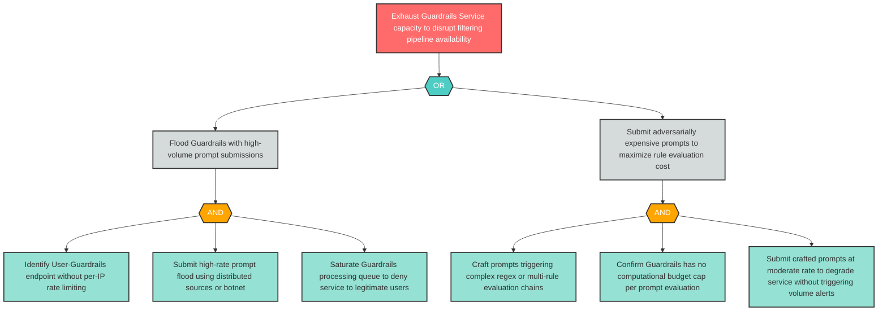

# Attack Tree: D-1 — Resource Exhaustion via High-Volume Computationally Expensive Prompts

**Finding ID**: D-1
**Risk Level**: Critical
**Component**: Guardrails Service
**Delta Status**: UNCHANGED

