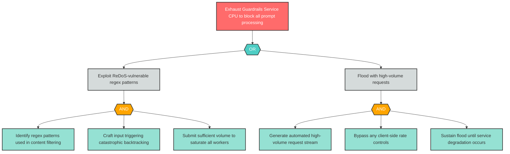

# Attack Tree: D-1 -- Guardrails Service Resource Exhaustion

| Field | Value |
|-------|-------|
| Finding ID | D-1 |
| Component | Guardrails Service |
| Risk Level | Critical |
| Threat | Guardrails Service Resource Exhaustion |
| Correlation | None |

