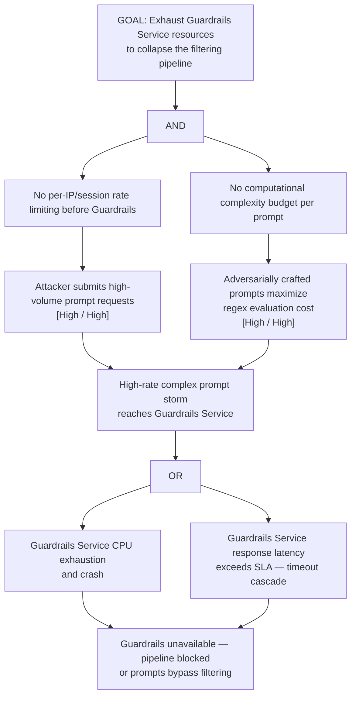

# Attack Tree: D-1 — Guardrails Service Resource Exhaustion

**Chain-breaking control**: Implement per-IP and per-session rate limiting at the network ingress (before the Guardrails Service). Apply a computational complexity budget per prompt evaluation; reject prompts that exceed the budget. Use asynchronous processing queues with backpressure.
