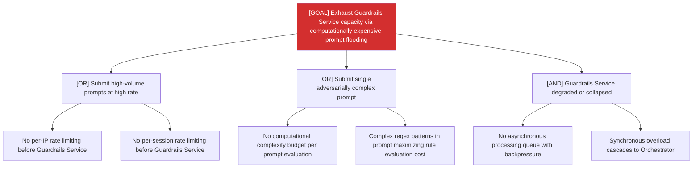

# Attack Tree: D-1 — Guardrails Service

**Risk Level**: Critical
**Component**: Guardrails Service
**Threat**: Resource exhaustion via high-volume computationally expensive prompts

```mermaid
graph TD
    Goal["[GOAL] Exhaust Guardrails Service capacity via computationally expensive prompt flooding"]
    Goal --> A["[OR] Submit high-volume prompts at high rate"]
    A --> A1["No per-IP rate limiting before Guardrails Service"]
    A --> A2["No per-session rate limiting before Guardrails Service"]
    Goal --> B["[OR] Submit single adversarially complex prompt"]
    B --> B1["No computational complexity budget per prompt evaluation"]
    B --> B2["Complex regex patterns in prompt maximizing rule evaluation cost"]
    Goal --> C["[AND] Guardrails Service degraded or collapsed"]
    C --> C1["No asynchronous processing queue with backpressure"]
    C --> C2["Synchronous overload cascades to Orchestrator"]
    classDef critical fill:#d32f2f,color:#fff
    class Goal critical
```
