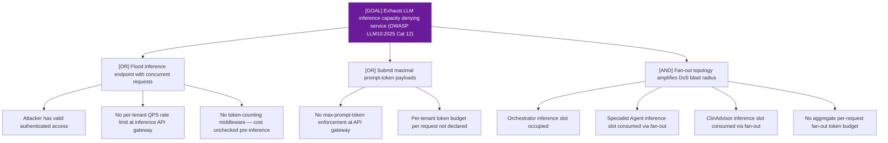

# Attack Tree: D-10 — LLM Agent Orchestrator

**Risk Level**: Critical
**Component**: LLM Agent Orchestrator
**Threat**: LLM inference-request flooding and token exhaustion (OWASP LLM10:2025)

```mermaid
graph TD
    Goal["[GOAL] Exhaust LLM inference capacity denying service (OWASP LLM10:2025 Cat 12)"]
    Goal --> A["[OR] Flood inference endpoint with concurrent requests"]
    A --> A1["Attacker has valid authenticated access"]
    A --> A2["No per-tenant QPS rate limit at inference API gateway"]
    A --> A3["No token-counting middleware — cost unchecked pre-inference"]
    Goal --> B["[OR] Submit maximal prompt-token payloads"]
    B --> B1["No max-prompt-token enforcement at API gateway"]
    B --> B2["Per-tenant token budget per request not declared"]
    Goal --> C["[AND] Fan-out topology amplifies DoS blast radius"]
    C --> C1["Orchestrator inference slot occupied"]
    C --> C2["Specialist Agent inference slot consumed via fan-out"]
    C --> C3["ClinAdvisor inference slot consumed via fan-out"]
    C --> C4["No aggregate per-request fan-out token budget"]
    classDef critical fill:#d32f2f,color:#fff
    classDef llm10 fill:#6a1b9a,color:#fff
    class Goal llm10
```
