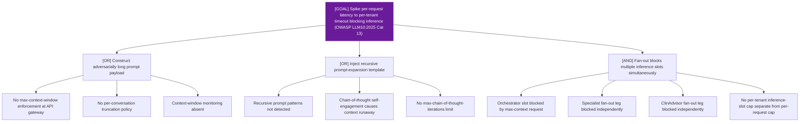

# Attack Tree: D-11 — LLM Agent Orchestrator

**Risk Level**: Critical
**Component**: LLM Agent Orchestrator
**Threat**: Context-window latency amplification blocking inference slots (OWASP LLM10:2025 Vector A)

