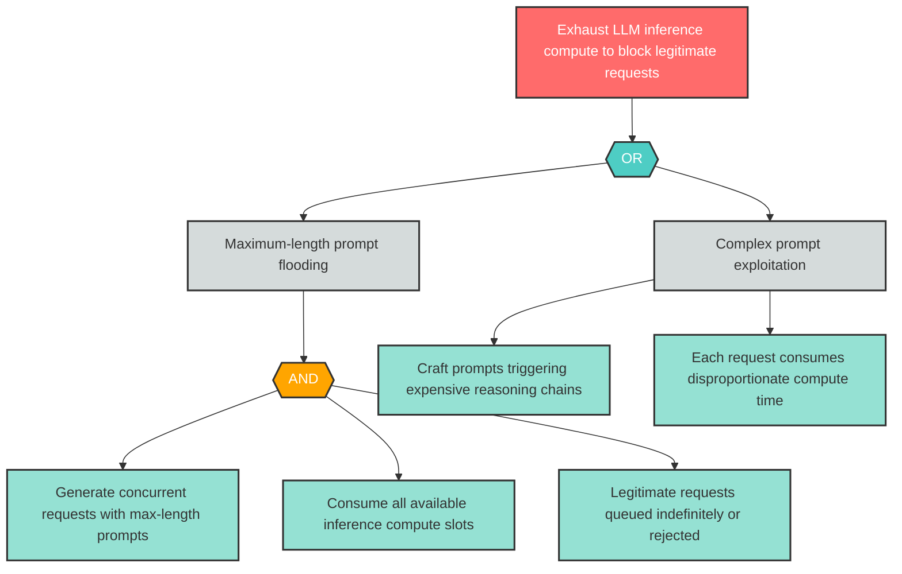

# Attack Tree: D-2 -- Orchestrator Compute Exhaustion

| Field | Value |
|-------|-------|
| Finding ID | D-2 |
| Component | LLM Agent Orchestrator |
| Risk Level | Critical |
| Threat | Orchestrator Compute Exhaustion |
| Correlation | None |

