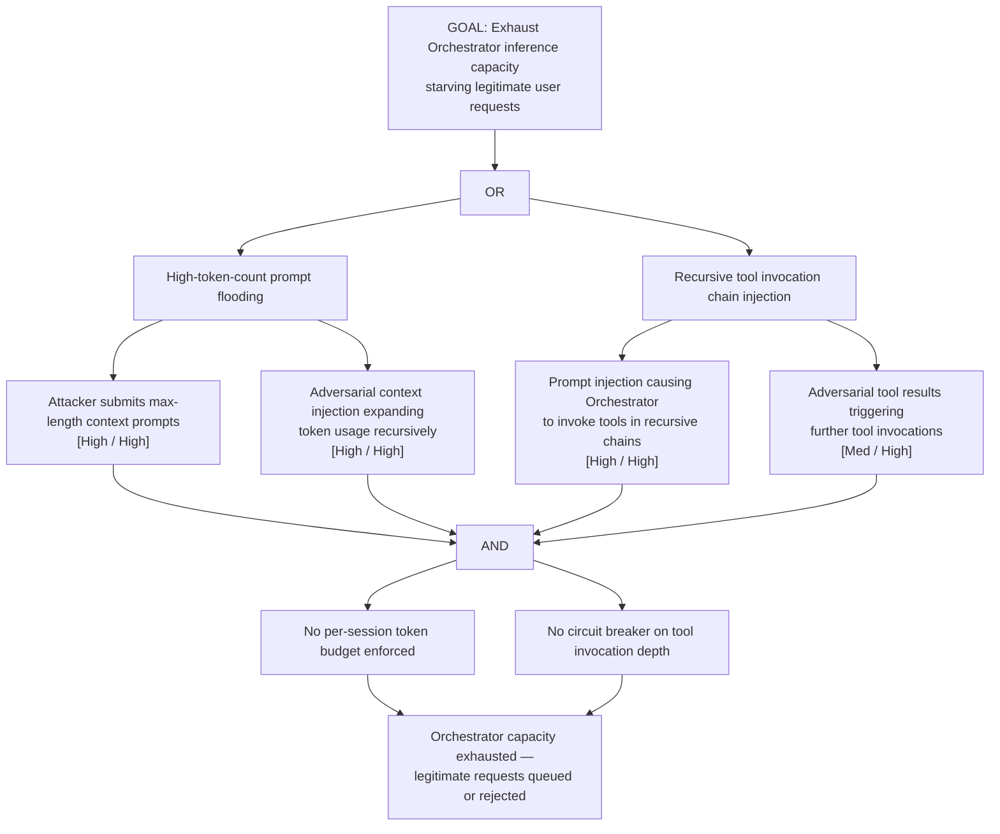

# Attack Tree: D-2 — LLM Agent Orchestrator Inference Pipeline Exhaustion

**Chain-breaking control**: Implement per-session token budgets and hard context-window limits. Apply circuit breakers on tool invocation chains (maximum recursive depth per session). Use request queuing with priority tiers and capacity-based load shedding.
