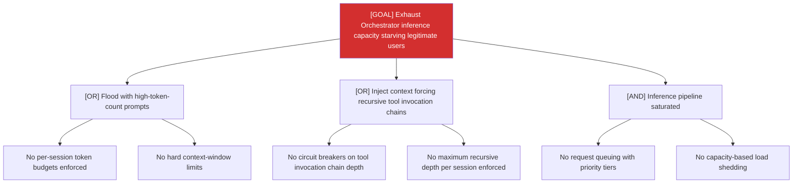

# Attack Tree: D-2 — LLM Agent Orchestrator

**Risk Level**: Critical
**Component**: LLM Agent Orchestrator
**Threat**: Inference pipeline exhaustion via high-token prompts or recursive tool chains

