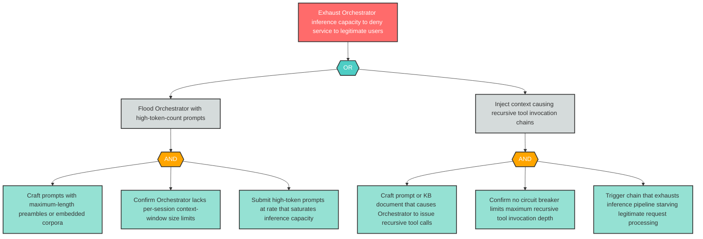

# Attack Tree: D-2 — Orchestrator Inference Pipeline Exhausted via Token Flood or Recursive Tool Chains

**Finding ID**: D-2
**Risk Level**: Critical
**Component**: LLM Agent Orchestrator
**Delta Status**: UNCHANGED

