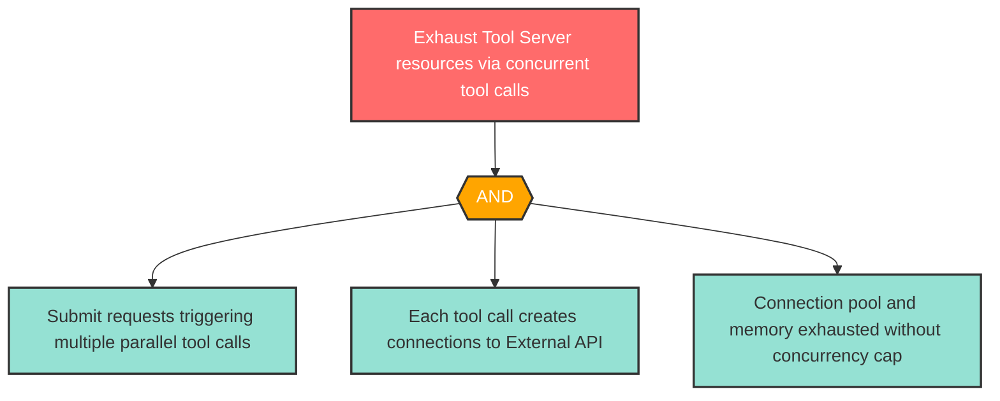

# Attack Tree: D-3 -- Tool Server Concurrent Execution Exhaustion

| Field | Value |
|-------|-------|
| Finding ID | D-3 |
| Component | MCP Tool Server |
| Risk Level | High |
| Threat | Tool Server Concurrent Execution Exhaustion |
| Correlation | CG-4 (See also: AG-4) |

