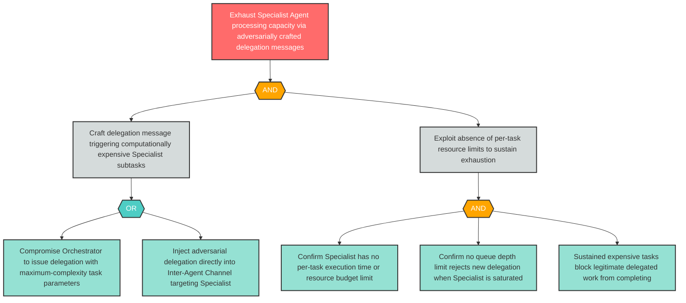

# Attack Tree: D-3 — Computationally Expensive Delegated Tasks Exhaust Specialist Agent Capacity

**Finding ID**: D-3
**Risk Level**: High
**Component**: Specialist Agent
**Delta Status**: UNCHANGED

