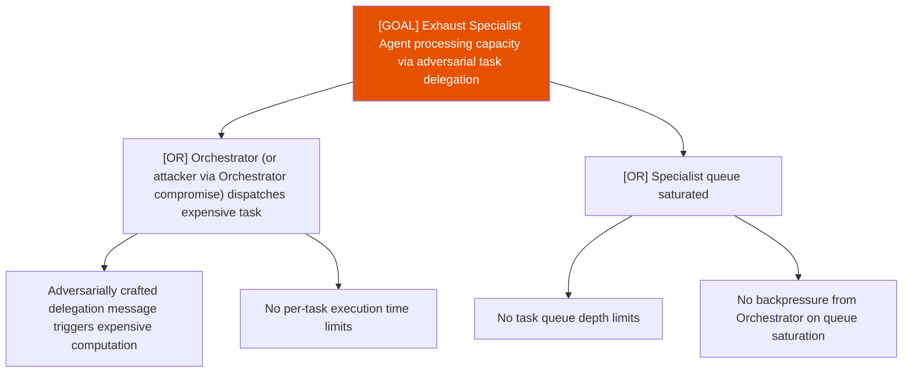

# Attack Tree: D-3 — Specialist Agent

**Risk Level**: High
**Component**: Specialist Agent
**Threat**: Computationally expensive delegated tasks exhaust Specialist capacity

```mermaid
graph TD
    Goal["[GOAL] Exhaust Specialist Agent processing capacity via adversarial task delegation"]
    Goal --> A["[OR] Orchestrator (or attacker via Orchestrator compromise) dispatches expensive task"]
    A --> A1["Adversarially crafted delegation message triggers expensive computation"]
    A --> A2["No per-task execution time limits"]
    Goal --> B["[OR] Specialist queue saturated"]
    B --> B1["No task queue depth limits"]
    B --> B2["No backpressure from Orchestrator on queue saturation"]
    classDef high fill:#e65100,color:#fff
    class Goal high
```
