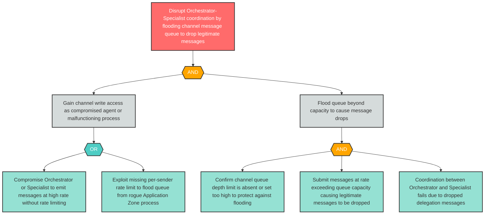

# Attack Tree: D-4 — Inter-Agent Channel Message Queue Flooded to Drop Legitimate Coordination Messages

**Finding ID**: D-4
**Risk Level**: High
**Component**: Inter-Agent Communication Channel
**Delta Status**: UNCHANGED

