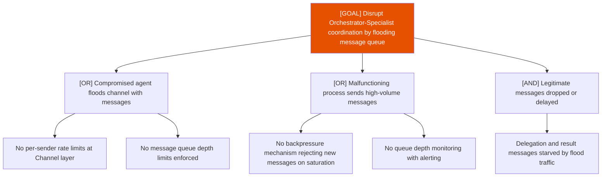

# Attack Tree: D-4 — Inter-Agent Communication Channel

**Risk Level**: High
**Component**: Inter-Agent Communication Channel
**Threat**: Message queue flooding drops legitimate coordination messages

