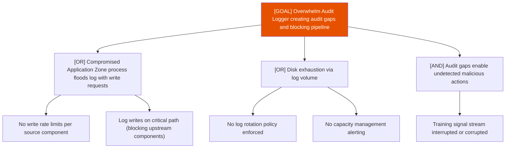

# Attack Tree: D-7 — Audit Logger

**Risk Level**: High
**Component**: Audit Logger
**Threat**: Log-flooding attack creates audit gaps and blocks pipeline operations

```mermaid
graph TD
    Goal["[GOAL] Overwhelm Audit Logger creating audit gaps and blocking pipeline"]
    Goal --> A["[OR] Compromised Application Zone process floods log with write requests"]
    A --> A1["No write rate limits per source component"]
    A --> A2["Log writes on critical path (blocking upstream components)"]
    Goal --> B["[OR] Disk exhaustion via log volume"]
    B --> B1["No log rotation policy enforced"]
    B --> B2["No capacity management alerting"]
    Goal --> C["[AND] Audit gaps enable undetected malicious actions"]
    C --> C1["Training signal stream interrupted or corrupted"]
    classDef high fill:#e65100,color:#fff
    class Goal high
```
